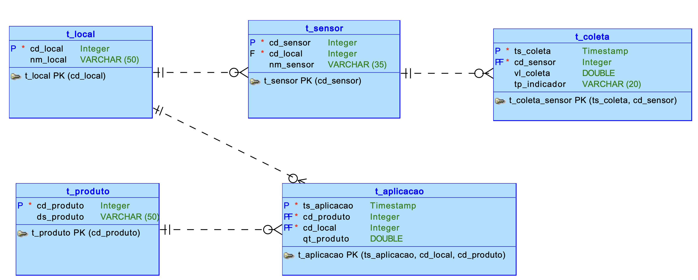

# Modelagem de Dados para Agro
## 1 - Introdução
O objetivo deste repositório é documentar a modelagem criada para o trabalho capitulo 1 fase 2 do curso Fiap de Inteligencia Atificial.

O Desafio é modelar um banco de dados capaz de coletar dados de sensores na lavroura e permitir uma análise das ações ao longo do tempo em resposta aos indicadores monitorados para calcular a eficácia das ações e permitir otimizar o cultivo.

## 2 - Modelagem

## 3 - Detalhe das entidades

### t_local
Esta entidade tem por objetivo armazenar os dados dos locais da fazenda monitorados pelos sensores

### t_sensor
Esta entidade tem por objetivo armazenar os dados dos sensores que tem relação com o local, porque todo sensor precisa estar instalado em um local específico para que o agricultor saiba em que local reagir com base nos dados coletados

### t_coleta
Esta entidada registra os dados coletados de cada sensor, com as referencias para o sensor, o valor indicado e o tipo (que pode variar dependendo do sensor, os valores possíveis são pH, Umidade, Fósforo e Potássio, cada coleta se refere a uma tipo somente). A modelagem já esta preparada para novos indicadores que possam ser coletados pelos sensores sem necessidade de alterações

### t_produto
Esta entidade armazena os dados dos produtos que podem ser administrados nos locais em reação a algum problema identificado pela coleta. Exemplos de produtos podem ser: água, adubo, fertilizantes, por exemplo. 

### t_aplicacao
Esta entidade tem por objetivo registrar sempre que um produto é administrado em algum local. A ideia é poder analisar o resultado (eficiencia) da aplicação de determinado produto em resposta a algum indicador coletado. 

## 4 - Equipe / Grupo
Este trabalho foi realizado em grupo pelos seguintes alunos:

Richard - rm563313

Douglas - rm561335

Evelyn -  rm562451

Lucas - rm564892

Luis - rm565285
